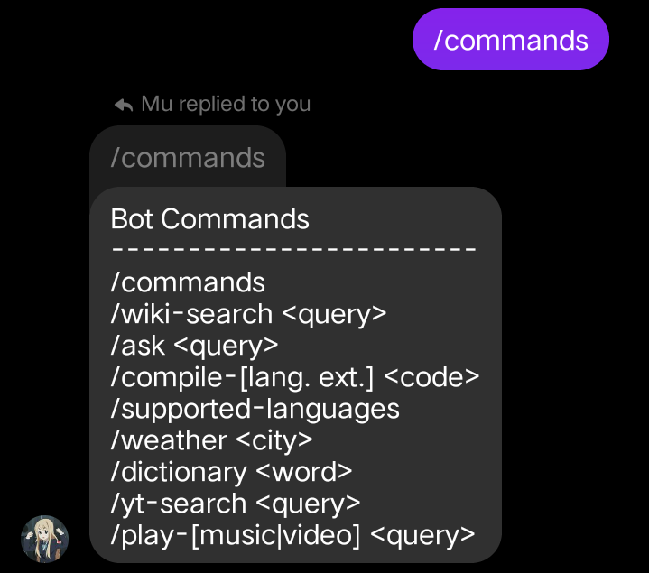
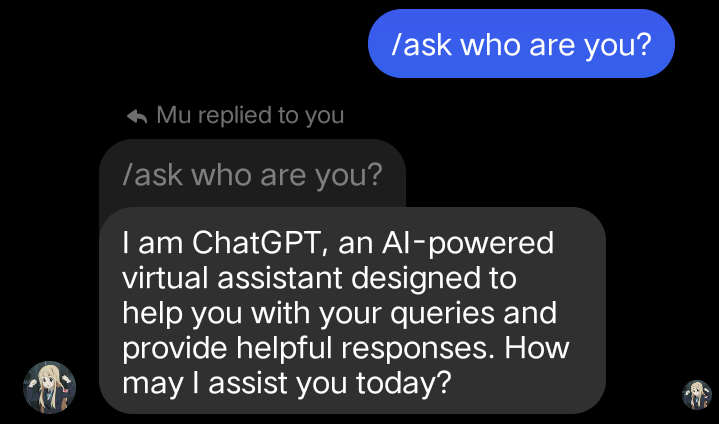
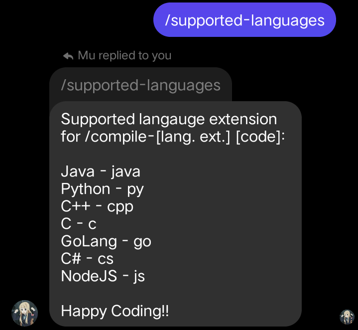
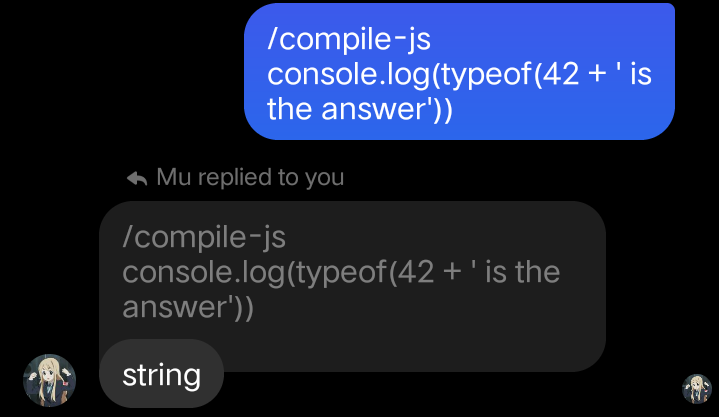
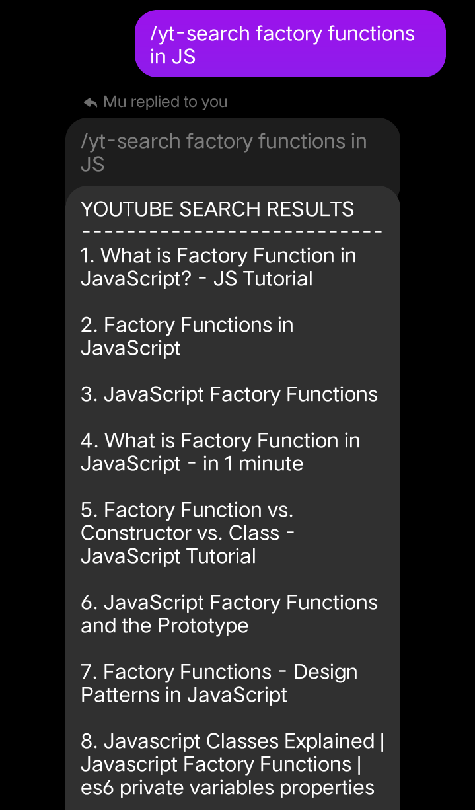
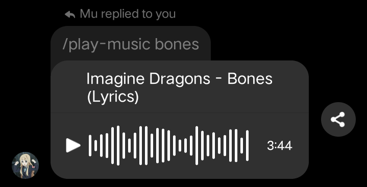
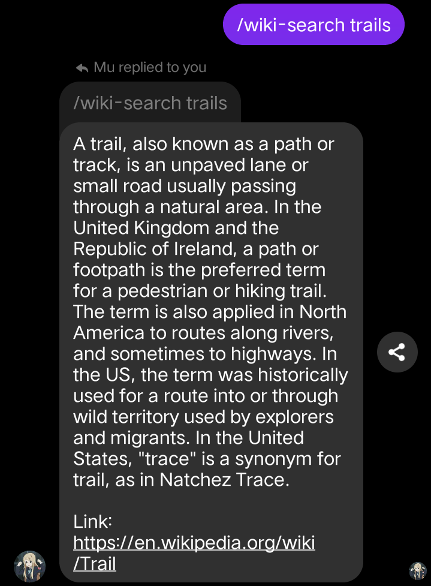
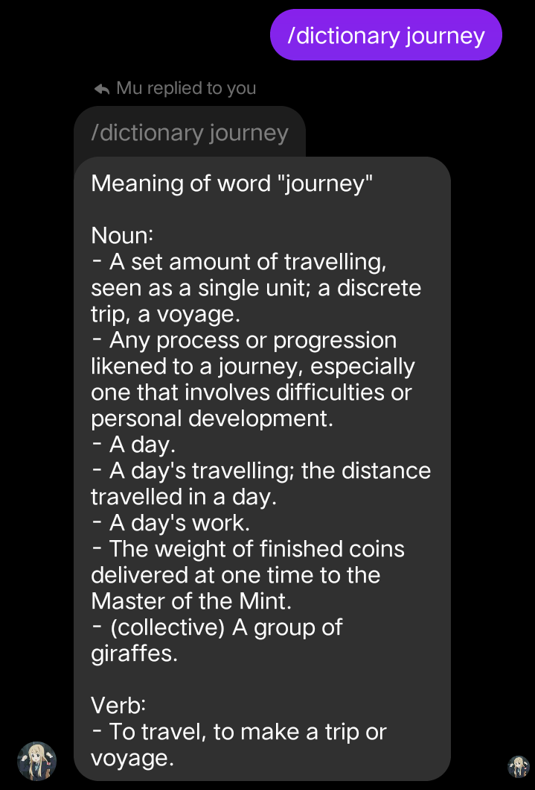

# Mugi Bot

A messenger bot is a chatbot that integrates with Facebook Messenger. It allows users to interact with the bot through text messages, making it easy to use and accessible to a wide range of users. The bot can be used to perform a variety of tasks, such as searching the internet, retrieving information from APIs, and playing music.

The project includes a variety of unofficial integrated API's, such as ChatGPT, yt2mate (youtube downloader), dictionary, wikipedia, online compiler, and the OpenWeatherMap API. These APIs allow users to perform a wide range of tasks, such as searching for information, downloading videos, and checking the weather.

The project was created using Node.js and the Express framework, and includes a web interface for users to interact with the bot. The bot is designed to be easy to use and can be added to a Facebook group chat to provide users with a convenient way to access the bot's features.

## Main Objectives

The main objectives of this project were to:

- Extend the features that Facebook Messenger has. By creating a messenger bot, the project demonstrated how to integrate with a popular messaging platform and extend its functionality.
- Understand how to use different HTTP methods. The project used HTTP methods such as GET, POST, and DELETE to communicate with the APIs and the web interface.
- Make my own APIs using third-party libraries of Node.js. The project used third-party libraries such as Axios and Cheerio to make HTTP requests and parse HTML responses, respectively. By using these libraries, the project was able to create APIs that interacted with the web interface and the APIs.

## Key Features

    
  All Commands.

    
  Unofficial ChatGPT API

    
  Supported Languages.

    
  Online Compiler.

    
  Youtube search result

    
  Unofficial Youtube API to play music.

    
  Using wikipedia

    
  Using Dictionary

     Open Weather API 

## What I've Learned

Through this project, I gained the following knowledge and skills:

- How to create my own web servers using Node.js and Express.js. This was a valuable skill that I will use in future projects to create web applications and APIs.
- How to use Postman to test API endpoints and ensure that they are working correctly. This was a crucial skill that I will use in future projects to ensure that my APIs are reliable and scalable.
- How to use the built-in libraries in Node.js such as the file system (fs) and http. These libraries provide a lot of functionality that can be used to create powerful web applications and APIs.
- How to work with APIs and how to integrate them into web applications. This was a valuable skill that I will use in future projects to create web applications that interact with other services and APIs.
- How to work with third-party libraries in Node.js and how to use them to create powerful APIs. This was a valuable skill that I will use in future projects to create APIs that provide useful functionality to users.

Overall, this project provided me with a solid foundation in web development using Node.js and Express.js, as well as knowledge of how to work with APIs and third-party libraries. These skills will be valuable in future projects and will help me create more robust and scalable web applications and APIs.

## Quick Installation

1. Clone the repository to your local machine:

   `git clone https://github.com/MiDo-kun/Messenger-Bot.git`

2. Navigate to the project directory:

   `cd your-repository`

3. Install the dependencies:

   `npm install`

4. Create your own `.env file`, coply the contents of `.env-sample` and fill in the :

   `USERNAME_ACC and PASSWORD` with your facebook account.
  
5. Create your own `fbState.json` and copy the contents from `fbState.json.sample` file.

6. Start the application by running the command

   `node index.js`

## Contributing

Contributions are welcome! If you want to contribute to the project, please follow these guidelines:

1. Fork the repository to your own GitHub account.

2. Clone the repository to your local machine:

   `git clone https://github.com/MiDo-kun/Messenger-Bot.git`

3. Create a new branch for your changes:

   `git checkout -b your-branch-name`

4. Make your changes to the code.

5. Commit your changes:

   `git commit -m "Your commit message"`

6. Push your changes to your fork:

   `git push origin your-branch-name`

7. Create a pull request from your fork to the main repository.

## License

This project is licensed under the MIT License. See the LICENSE file for more information.
